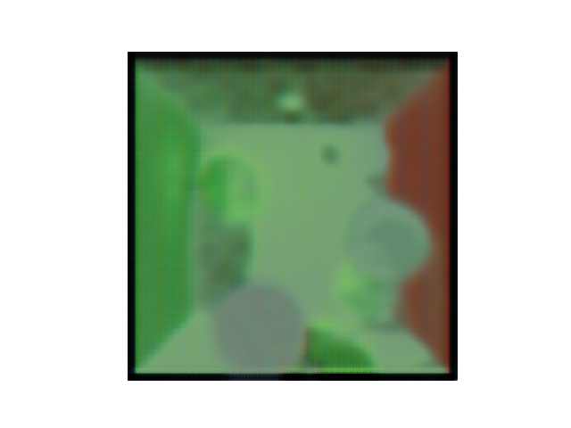

# De-noising networks

Deep learning de-noising networks using different architectures implemented in pytorch.

Inteded to be used with a custom-made path tracer to make it converge faster to the rendered image of a scene.

## Encoder decoder architecture

Works and I have results.

### Results

- 160 epochs, lr=0.0001

## Diffusion model architecture

Skip connections
