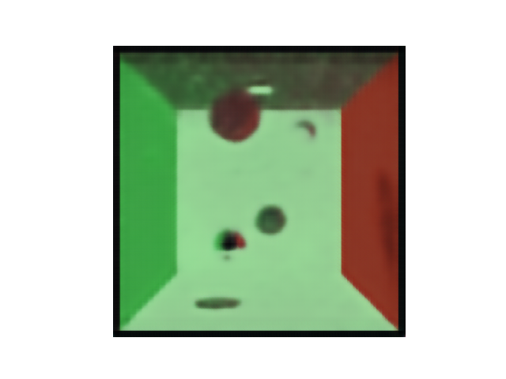
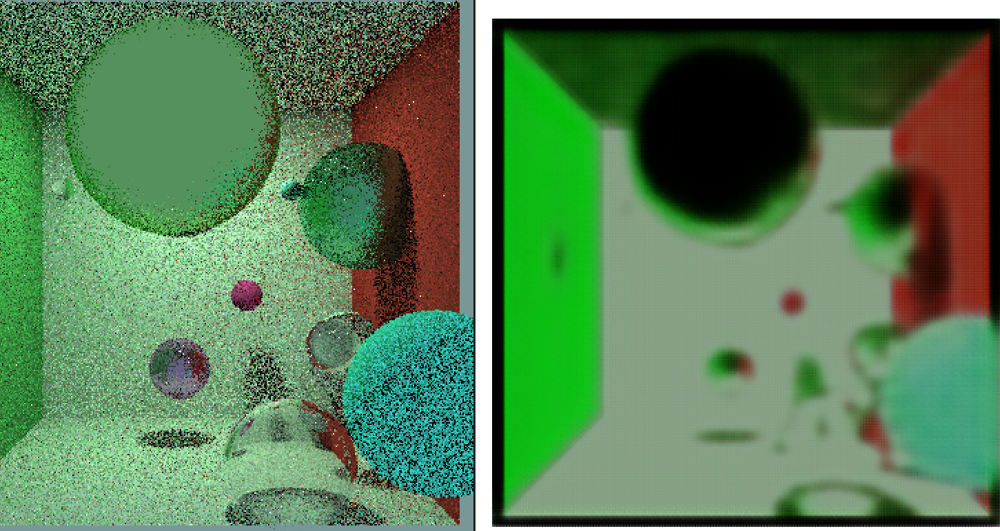
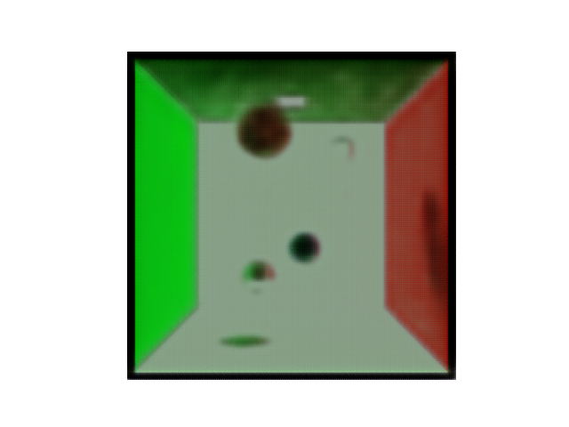

# De-noising networks

Deep learning de-noising networks using different architectures implemented in pytorch.

Intended to be used with a custom-made path tracer to make it converge faster to the rendered image of a scene.

## Encoder decoder architecture

### Results

- 30 epochs, lr=0.0001. Problems: low res
  

## Diffusion model architecture

Whats different? Diffusion steps with ResNet blocks

In comparison

- 15 epochs, lr=0.0001
  
