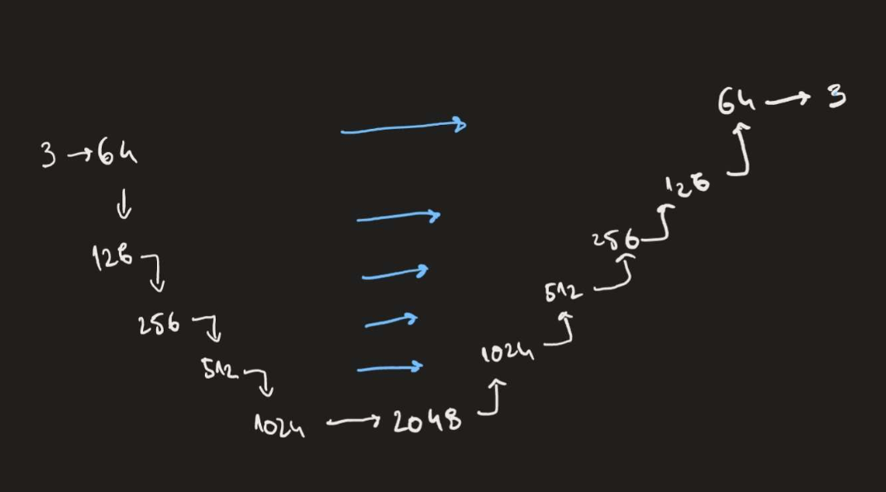

# De-noising networks

Deep learning de-noising networks using different architectures implemented in pytorch.

Intended to be used with a custom-made path tracer to make it converge faster to the rendered image of a scene.

## U-net

It's a 5 layer deep U-Net architecture with skip connections, so it can get the full details of the rendered images

Architecture:

Loss functions tried:
- MSE
- SSIM
- SIMD
- L1

### Results

Trains really quickly. **Note**: will re-train on a more noisy data. 

|               Before                |               After                |
|:-----------------------------------:|:----------------------------------:|
|  |  |

## Encoder decoder architecture

Failed architecture because of how un-precise the images get predicted.

### Results

In comparison

